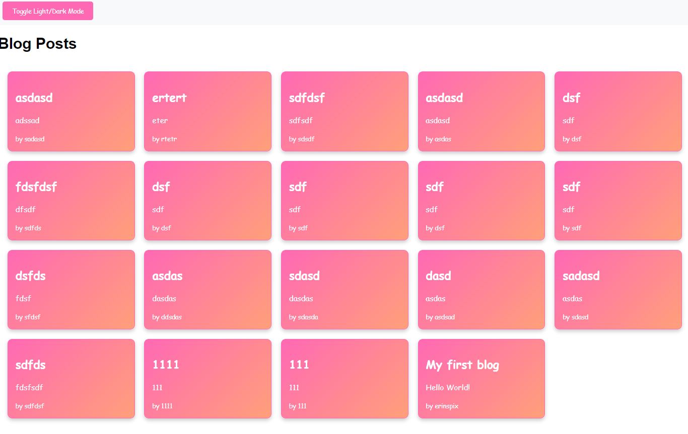

# Personal Blog

## Description

"My First Blog" is a simple web application designed for creating and viewing personal blog posts. The app uses localStorage to save posts, allowing for easy access and management.

## Table of Contents

- [Description](#description)
- [Installation](#installation)
- [Usage](#usage)
- [License](#license)
- [Contributing](#contributing)
- [Tests](#tests)
- [Questions](#questions)

## Installation
navigate to landing page
Landing Page (Form Page)

## Usage

The landing page features a form with input fields for username, blog title, and content.

## License

This project is licensed under the MIT license.

## Contributing

Upon submitting the form, the blog post data is saved to localStorage, and you are redirected to the posts page.

## Tests

If any fields are left empty, a prompt will alert you to complete the form before submission.

## Questions

For any questions, please contact me with the information below:

GitHub: [A toggle button allows switching between light and dark modes, updating the page’s style accordingly.](https://github.com/A toggle button allows switching between light and dark modes, updating the page’s style accordingly.)  
Email: The "Back" button redirects to the landing page for creating additional blog entries.

## Images
Home page with input form:

Blog post page with previous posts:

